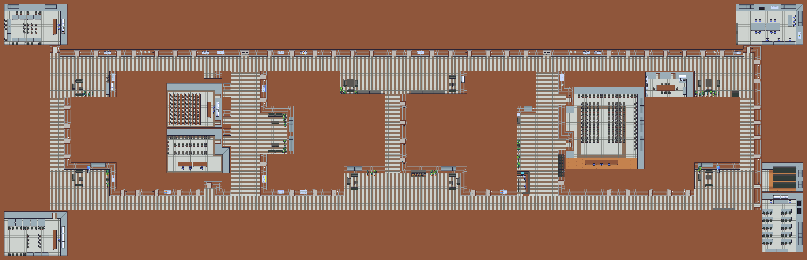

# Virtual Department
Tile map of the [Computer Science Department](https://di.unipi.it/virtual-tour/) of Università di Pisa, for [gather.town](https://gather.town/) meetings or other bit-related stuff.

## Contents

 * [background.png](/background.png), decorated background image of the department (*work in progress*);
 * [background_clean.png](/background_clean.png), same background image of the department, but without decorations (no forniture, plants, etc);
 * [foreground.png](/foreground.png), foreground image;
 * [tileset.png](/tileset.png), tiles used to design the map (most tiles are taken from the [public gather.town tileset](https://github.com/gathertown/mapmaking)).
